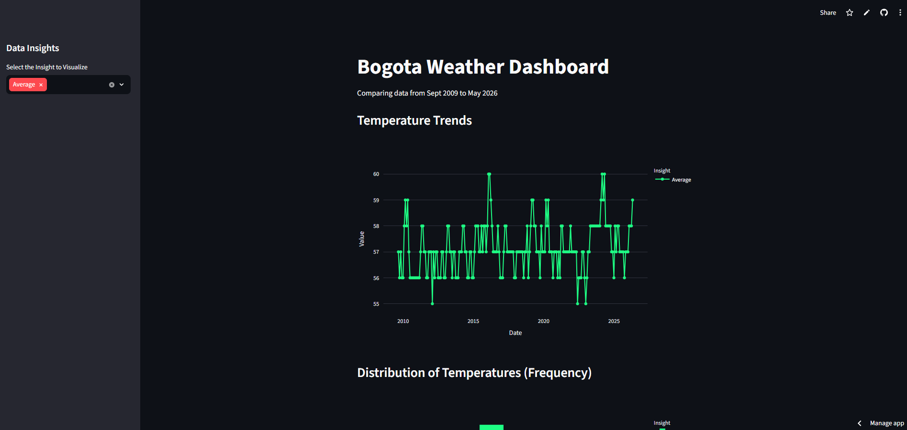

# CTD_scrapping
Educational project to apply web scrapping, data cleaning, data transformation and data visualization techniques learned on the python essentials class - CTD 2026.

## Bogota Weather Dashboard

This project is a data analysis pipeline and interactive dashboard that tracks historical temperature data for Bogota, Colombia. It automates the extraction, cleaning, and visualization of weather trends from September 2009 to May 2026.

## Project Structure

+ scrapping.py: Uses Selenium to retrieve historical weather tables. It includes custom user-agent headers, handles dynamic content via sleep timers, and exports data to both .csv and .json formats.

+ database.py: A dedicated script that loads cleaned data into a sqlite3 database, ensuring data persistence and efficient querying for the dashboard.

+ dashboard.py: The Streamlit application. It implements interactive multi-select filters and displays three distinct visualizations using Plotly.

+ requirements.txt: A complete list of dependencies for a reproducible environment.

## Features

+ Automated Scraping: Efficiently captures historical monthly weather data.
+ Data Transformation: Raw data is cleaned using Pandas to handle datetime formatting, column renaming, and removal of noise (e.g., annotations and "Past 2 Weeks" entries).
+ Interactive Visualizations:
    + Temperature Trends: Line chart showing historical fluctuations.
    + Temperature Distribution: Histogram for frequency analysis.
    + Seasonality + Heatmap: Pivot-table based heatmap for yearly comparisons.

## Setup and Instructions

+ Ensure you have Python installed, then install dependencies:

        pip install -r requirements.txt

+ Run the Pipeline:

    1. Scrape the data
        
        python scrapping.py

    2. Setup the database
        
        python database.py

    3. Launch the Dashboard
        
        streamlit run dashboard.py

## Dashboard Preview

